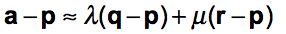
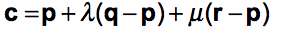
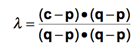
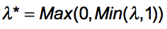
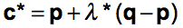

.. meta::
    :description: Andrew Hundt and Alex Strickland Computer Integrated Surgery 600.445 Coursework Repository

.. raw:: latex

    \pagebreak

========
Overview
========

Andrew Hundt and Alex Strickland Computer Integrated Surgery 600.445 Coursework Repository

Introduction
============

PA1
---
 
The purpose of PA1 was to develop an algorithm for a 3D point set to 3D point set registration and a pivot
calibration. The problem involved a stereotactic navigation system and an electromagnetic positional tracking
device. Tracking markers were placed on objects so the optical tracking device and an electromagnetic tracking
device could measure the 3D positions of objects in space relative to measuring base units. These objects were
then registered so that they could be related in the same coordinate frames. Pivot calibration posts were placed
in the system so pivot calibration could be performed and the 3D position of two different probes could be
tracked throughout the system. The diagram below from the assignment document gives a visual description of the
system.

.. image:: static/CIS_PA1_AssignmentPicture.png

PA2
---

In addition to all of the steps outlined in PA1, the core purpose of PA2 was to develop an algorithm for
distortion correction and to implement it for use with the stereotactic navigation system of PA1. In addition to
distortion correction, we performed registration of the device coordinate frames to prior CT coordinate frames.

PA3
---

The purpose of PA3 was to develop an iterative-closest point (ICP) registration algorithm. The problem
involved a 3D triangular surface mesh of a bone found in CT coordinates and two rigid bodies. One rigid body
is rigidly attached to the bone and one to be used as a pointer. LED markers were attached to the two rigid
bodies so that the coordinates could be determined in optical coordinates. An ICP registration was implemented
so that a the closest point on the triangular mesh could be found to a number of points where the tip of the
pointer contacted the bone. The diagram below from the assignment document gives a visual description of the
system.

.. image:: static/PA3_Problem_Drawing.png

Mathematical Approach
=====================

Distortion Correction
---------------------

A number of distortion correction methods are available to correct for inaccuracies among various sensor
coordinate systems and the real physical dimensions of the world. We seleced Bernstein polynomials for our
implementation due to their numerical stability and accuracy for the specific electromagnetic distortion problem
we encounter. The basic idea in this case is to construct a 3D polynomial representing the spatial flexing
caused by distortions in measurements.

To reap the best of the numerical stability properties of the Bernstein polynomial we scale the input values to
the range from 0 to 1. Therefore we scale the values to within the range [0,1] in each dimension, utilizing the
minimum bounding rectangle (MBR) to determine the scale factor. Then, we construct a 5th degree Bernstein
polynomial for each point using the polynomial function outlined in slide 18 of the InterpolationReview.pdf
lecture notes pictured below.

We then stack the polynomials to form the F Matrix, although this polynomial can be increased for higher
precision or decreased for higher performance as needed. Once we have these polynomials stacked as a large
matrix we solve the least squareds problem utilizing SVD against the ground truth data, as outlined on slide 43
of the lecture notes pictured below.

.. image:: static/bernstein_polynomial_SVD_3D_calibration.png

The output of that equation is the calibration coefficient matrix which can then be multiplied by the stacked F
matrix of a distorted point set to generate the final corrected and undistorted point set. Multiplication of a
stacked matrix is a more efficient alternative to the loop of sums from the slides.

Tradeoffs
~~~~~~~~~

One of the particular advantages of Bernstein polynomials is the ability to select the degree of the polynomial.
The polynomial degree presents an interesting tradeoff, because a higher degree polynomial allows more precise
representation of distortions and lower error. This benefit comes at the cost of an exponential increase in
computation time for each additional polynomial degree.

Point Cloud Registration
------------------------

A number of least squares methods could be used to determine a transformation matrix for a 3D point set
registration. We selected Horn’s method because a rotation matrix is always found and no iterative approximation
is involved. The first step is to find the centroid of the point clouds in the two different coordinate systems.
Then the centroid is subtracted from each point measurement of the separate point clouds so the points will be
relative to the centroid. Next an H matrix is created which is the sum of the products of each corresponding
point in the two frames. A real symmetric G matrix is then created from the sums and differences of the elements
in the H matrix which was previously created. Next, the eigenvalues and corresponding eigenvectors of the G
matrix were calculated. The eigenvector corresponding to the most positive eigenvalue represents the unit
quaternion of the matrix. Once the quaternion is known, the rotation matrix can be found using Rodriguez’s
formula. The translation between the two coordinate systems is next found from the difference between the
centroid of the known point cloud and the scaled centroid of the unknown point cloud. Finally a homogeneous
transformation matrix could be made to know the frame transformation between the two point clouds.

Pivot Calibration
-----------------

For the pivot calibration, singular value decomposition was used to estimate the orientation of the probe by
finding the positions of the centroid of the tracked markers on the probe and the tip of the probe. First, a
matrix was created which consisted of the rotation matrices calculated in each frame and the negative identity
matrix found using Horn’s method.\[1] Next, a vector was created which consisted of the stack of the translation
vectors in each frame also found using Horn’s method. The singular value decomposition of the matrix was
performed to split the matrix into the matrices containing the singular values, the left-singular vectors, and
the right singular vectors. Once this was done, the vector between the centroid of the tracked markers on the
probe and the probe tip could be approximated using the SVD matrices and the translation vectors of each frame.

 * \[1] Horn, Closed-form solution of absolute orientation using unit quaternions, Optical Society of America (1987)

 
 
Finding the Closest Point on a Triangle
---------------------------------------
 
If the vertices of a triangle are know and there is a point in space, then the closest point that lies on the triangle to 
the point in space can be found. This is done by using the equations (from the Point Pairs lecture slides) given below:

Where a is the point in space, p, q, and r are the vertices of the triangles, and c is the closest point that lies on the 
triangle. If the following constraints (from the Point Pairs lecture slides) are true:
 
 .. image:: static/PA3_Constraint1.png
 
Then the c is the closest point and lies within the triangle's boundaries. A 2x2 linear system can then be solved using
an explicit least squares approach to find lambda and mu. If the closest point lies on the boundaries of the triangle, 
then the point must be projected onto every side of the triangle. The equations (from the Point Pairs lecture slides)
below how this is implemented:

Where p and q are the two end points of the line segment, c is the point to be projected on the line segment, c* is the 
projected point on the line segment, and lambda* is the ratio of normalized length from p to c*. If two of the three c* 
projections lie on the same vertice, then the closest point on the triangle is that vertice. Otherwise, the closest point 
will be the c* projection on the side whose value for lambda* satisfies the conditions of being between one and zero. 
Then the equation (from the Point Pairs lecture slides) below is implemented to find the closest point c*:

ICP
---
The ICP approach for this programming assignment was very simple. For every triangle in the mesh, the find the closest
point method was implemented. Once closest point was found, the error between the two points was computed by taking the
norm. Then the triangle, whose pointed produced the smallest error, was said to be the closest point on the mesh. 

 
 
Algorithmic Approach:
=====================

Parsing
-------

We developed our algorithm using C++. The Eigen library was used as a Cartesian math package for 3D points,
rotations, and frame transformations. The Boost library was also used to write a parser file and develop various
aspects of our algorithms. The first step was to write parser code that could interpret the given data. The
parser needed to interpret which data set was being entered, the number of frames in each data set, and which
markers were being tracked in the data set. The parser would store the data as Eigen matrices to be easily used
for our algorithms.

Transforms
----------

Once the data was parsed, two matrices containing marker positions in different coordinate frames was put in the
function hornRegistration to determine the corresponding transformation matrix between the two frames. The first
step of the hornRegistration was to find the two centroids of two 3D marker positions and subtract it from each
marker position using functions in the Eigen library. The next step was to put these values in a function that
would create a 3x3 H matrix. Once this was done, the H matrix could be put in a separate function that would
calculate the 4x4 G matrix. The eigenvalues and the corresponding eigenvectors of the G matrix were next
calculated by using functions of the Eigen library. A vector of each eigenvalue and the corresponding
eigenvector was then created so that the eigenvalues could be sorted to find the most positive eigenvalue and
its corresponding eigenvector which represented the unit quaternion of the rotation. Next, the 3x3 rotation
matrix was created by an Eigen function that converted a unit quaternion into the corresponding rotation matrix.
Finally, the translation vector between the two centroids was calculated and a 4x4 homogeneous transformation
matrix was created by using another function that takes a rotation matrix and a translation vector and outputs
the corresponding transformation matrix.

Pivot Calibration
-----------------

Next a pivot calibration algorithm was created which used both the parser and hornRegistration algorithms
mentioned above. First, the tracker data was parsed into separate matrices which corresponded to each frame of
tracked data. Each matrix of frame data was compared to the base matrix frame using the hornRegistration
function described above and the corresponding homogeneous transformation from the base frame to the current
frame was found. The rotational component of each frame was put into an Eigen matrix and the translational
component of each frame was put into an Eigen vector with the form described in the mathematical approach above.
The function of JacobiSVD of the Eigen library was then used to solve the least squares vector between the
rotational matrix and translation vectors. The least squares vector contained approximated orientation of the
probe and the position of the probe tip.

Distortion Calibration
----------------------

Next we create a distortion calibration algorithm, which followed the mathematical procedure outlined above. First,
the data was parsed and stored in a large vector so the the maximum and minimum values could be obtained in the X, Y,
and Z dimensions of the data set. Then the values of the data set were scaled to between [0 1] to create a minimum 
bounding box. We calculate Bernstein polynomials for each point and stack them into the F matrix. The Eigen library
is utilized to calculate the SVD of Fc=p, where F is the F matrix of Bernstein Polynomials, c is the calibration
coefficient matrix, and p is the undistorted points matrix that you compare the distorted points to. A separate
set of points can be scaled according to the same distortion parameters from above and the distortion associated with
their measurement can be corrected. 

Once this is done, an the same Fmatrix calculated above can be calculated for this new set of points. Then the c
calibration coefficient matrix was multiplied by the Fmatrix to find the undistorted points in the new coordinate system.
Once the data was undistorted, we were able to run a new pivot calibration with the undistorted points to see how well
our undistortion works. The next step was to use the distortion matrix to find CT fiducials in the EM frame. The new data
was scaled by the same scaling function as above and put into a new Fmatrix. In this way, a new Fmatrix could be found
and the measured points could be undistorted. Then these values were used with known values of points measured in the CT
frame to find a transformation matrix Freg that would take you from the EM frame to the CT frame. Finally the tip of the
EM probe could be measured in the CT frame.

 
ICP Registration
----------------

Next an ICP Registration algorithm was created which used both the parser and hornRegistration algorithms
mentioned above. First, each point of tracker data was parsed into Eigen vectors of (x,y,z) coordinates which 
corresponded to the position of the trackers attached to the rigid bodies, A and B, in optical coordinates  Next, another 
set of tracker data was parsed into Eigen vectors of (x,y,z) coordinates which corresponded to the position of the 
trackers attached to the rigid bodies in their body coordinates. The transformation matrix from the body frame to the 
optical tracker frame was then computed using the hornRegistration function described above. Then the coordinates tip of 
the rigid body A with respect to rigid body B was found by multiplying the vector of the tip in body A coordinates by the 
transformations previously found. 

Next, the mesh data was parsed so the vertices of each triangle was known. Then ICP registration could be used to find
the point on the mesh that was closest to the tip of rigid body A. First, the transformation from the CT mesh coordinates
to the rigid body B coordinates was assumed to be the identity matrix. Once this assumption was made, sample points were
found by multiply the transformation from CT mesh coordinates to the rigid body B coordinates by the tip of the pointer A
in rigid body A coordinates. Now these sample points were used to which points on the CT mesh they were closest to with
the given transformation. The simplest FindNearestPoint function was implemented in which the the nearest point to the
sample points on the CT mesh was calulated for every triangle in the mesh. The error between the two points for each
triangle was calculated by taking the norm between the points and the smallest error corresponded to the nearest point on
the mesh to the pointer tip A.

A more efficient method would be to run the FindNearestPoint function on only some of the triangles that passed initial 
criteria instead of all of the triangles. This would be done by using a data structure such as a bounding box or some 
type of hierarchical data structure.

Structure of the Program
========================

The software is structured as a set of header only libraries in the include folder, which are utilized by
the unit tests, main, and any external libraries that choose to use these utilities.

The most important files include:

=============================   ===============================================================================
File name                       Description
=============================   ===============================================================================
**IterativeClosestPoint.hpp**   Algorithm for finding ICP registration.
**hornRegistration.hpp**        Horn's method of Point Cloud to Point Cloud registration.
**DistortionCalibration.hpp**   Bernstein Polynomial method of distortion correction.
**hornRegistration.hpp**        Horn's method of Point Cloud to Point Cloud registration.
**PivotCalibration.hpp**        Pivot Calibration.
**PA2.hpp**                     **fiducialPointInEMFrame()** and **probeTipPointinCTFrame()** PA2 #4,6
**PA3.hpp**                     Implements icp solving of specific PA3 system.
**cisHW1test.cpp**              An extensive set of unit tests for the library relevant to PA1.
**cisHW2test.cpp**              An extensive set of unit tests for the library relevant to PA2.
**cisHW3test.cpp**              An extensive set of unit tests for the library relevant to PA3.
**cisHW1-2.cpp**                Main executable source, contains cmdline parsing code and produces output data.
**cisHW3-4.cpp**                Main executable source, contains cmdline parsing code and produces output data.
**parseCSV...**                 File parsing functions are in **parseCSV_CIS_pointCloud.hpp**.
=============================   ===============================================================================

Important Functions and Descriptions
------------------------------------

Each function includes substantial doxygen documentation explaining its purpose and usage. This documentation
can be viewed inline with the source code, or via a generated html sphinx + doxygen website generated using CMake. 
Here is a list of the most important functions used in the program is a brief description of each of them.

PA1
~~~

**EigenMatrix()**         	   

Computes the eigenvalues and corresponding eigenvectors from a given G matrix. It 
outputs a rotation matrix corresponding to the unit quaternion of the largest 
positive eigenvalue

**homogeneousmatrix()**          

Creates a 4x4 homogeneous matrix from a derived rotational matrix and translational vector

**hornRegistration()**

Computes the homogeneous transformation matrix F given a set of two cloud points. 
It is comprised of the various functions listed above

**homogeneousInverse()**		   

Computes the inverse of a given homogeneous matrix 

**registrationToFirstCloud()**   

Parses the data and runs the hornRegistration function for pivot calibration

**transformToRandMinusIandPMatrices()**   

Creates the A and b components of the form Ax=b for singular value decomposition.
A is of the form [R|-I] while b is of the form [-p] where R is the stack of 
rotational matrices of the F transformation matrices, I is stack of 3x3 identity 
matrices, and p is the stack of the translational vectors of the F transformation 
matrices.

**SVDSolve()**				   

Computes the x of the least squares problem Ax=b using singular value decomposition
when the stack of matrices in given

**Hmatrix()**   			
	
Computes a sum of the products H matrix given a set of two cloud points

**Gmatrix()**					  
 
Computes a sum of the differences of the given H matrix

**pivotCalibration()**

Computes the pivot point position from tracking data using the SVDSolve(), 
registrationToFirstCloud(), and transformToRandMinusIandPMatrices() functions

PA2
~~~

**CorrectDistortion()**

Correct distortions in one point cloud by utilizing distorted and undistorted versions of a second point cloud.
Bernstein Polynomials are utilized to perform the correction.

**BernsteinPolynomial()**

Find the solution to the Berstein polynomial when at varying degrees and points depending on the input.

**Fmatrix()**

Multiplies the Bernstein polynomial into a matrix so that a function of every degree of i, j, and k are found
and a distortion calibration can be done using the matrix.

**ScaleToUnitBox()**

Calculates maximum and minimum values in the X,Y, and z coordinates of a point cloud and then normalizes the 
value of every single opint.

**probeTipPointinCTF()**

Uses measured positions of EM tracker points on the EM probe in the EM frame when the tip is in a CT fiducial
and returns the point of the fiducial dimple (solves problem 5).

**fiducialPointInEMFrame()**

Uses measured positions of EM tracker points on the EM probe in the EM frame when the tip is in a CT fiducial
and returns points of the CT fiducial locations in EM frame.

PA3
~~~

**icpPointMeshRegistration()**

Primary function implementing the math specific to the system specified in PA3.

**FindClosestPoint()**

Finds the closest point on the triangle to a point in space. If the closest point lies with in triangle, then the
function finds the nearest point internally. Else if the closest point lies on an edge or vertice, the function
OutsideOfTriangle() is called to find the nearest point.

**OutsideOfTriangle()**

Finds the closest point on the triangle to a point in space if the closest point lies on an edge or vertice

**ProjectOnSegment()**

Finds the nearest point on a line segment to a point in space. Called by the function OutsideOfTriangle() to determine
where the nearest point is to each side of the triangle.

**PointEqualityCheck()**

Determines if two points are equal. Used by the function OutsideOfTriangle to determine if the nearest point on the
triangle lies on a vertice

Results and Discussion
======================

Validation
----------

We took several approaches to the validation of our software. These include manual and automatic execution of
the supplied test data, the implementation of unit tests to verify the data, and initial integration of
continuous integration software to catch errors early. We implemented a battery of unit tests to verify the
basic functions and ensure they are running correctly.

Point Cloud Registration
------------------------

We have been able to ensure that point cloud to point cloud registration is working correctly by finding the
transformation of one point cloud to another and then the opposite. Multiplying these two transformation
matrices together resulted in an identity matrix which would be expected. We tested the input data set as well,
ensuring that we were within the given tolerance range. This shows the strength of Horn’s method and since it requires no
special case exceptions for a solution, we concluded it was the best method of the one's taught in class.

Calibration
-----------

The position of the tip of the probe when calibrate by EM also gave us results well within our tolerance
levels. Our results were less accurate when error was introduced, but not to an unreasonable degree.

Finding the Closest Point on a Triangle
---------------------------------------

We have also been able to ensure that finding the closest point on a triangle algorithm is working correctly by assigning
vertices to an arbitrary triangle and then testing points in space where we knew what the closest point on the triangle
was. We tested the different special cases of the problem as the closest point lying within the boundaries of the
triangle, on one of the sides of the triangle, and on one of the vertices of the triangle. Our algorithm was able to
return the nearest point for every case.

Status of results
=================

PA 2
----

We have encountered errors in our software that we have narrowed down to points after the EM distortion calibration
steps, because we have been able to verify our Bernstein functions using unit tests and debug data. However, a bug
remains in either the steps for calculating Freg or finding each of the CT fiducial. Since the underlying components are
largely well tested, we expect the bug to be in the transform or data flow steps of the generateOutputFile() function in
cisHW1-2.cpp or the function definitions in PA2.hpp.

PA 3
----

Our initial algorithm passed our unit tests and gave us similar errors to the output data files. We concluded that our we
were able to successfully implement the first iteration of an ICP registration. Although the simlpest linear method was
implemented, our program was able to run the program of all debug and unknown data sets in less than thirty seconds even
in debug mode. Adding threads and running in release mode made our program run even faster. A data structure was not
needed for this assignment because we concluded that there was no problem with the speed of the program. For PA 4, we will
revaluate this conclusion as the ICP will need to iterate multiple times, greatly increasing our runtime.
 

Tabular Summary of PA 3 Unknown Data Results
--------------------------------------------

=================   ===============   ===============   ===============
Point Number        Error in G Data   Error in H Data   Error in I Data
=================   ===============   ===============   ===============
       1               0.14811            0.77494            2.84084   
       2               0.60432            0.96266            0.46215      
       3               2.24293            0.67760            4.43498      
       4               0.76945            0.24216            1.77055      
       5               1.45001            0.51152            0.40509      
       6               0.80641            1.54260            0.10251      
       7               0.86017            0.24527            0.30031      
       8               2.61080            0.72909            0.79210      
       9               2.10517            0.48146            2.54912      
       10              0.96220            0.30248            2.07283      
       11              0.00198            1.43465            5.54007      
       12              2.45932            0.01729            1.06041
       13              1.47099            1.38414            2.93195
       14              1.34390            0.42595            1.44610
       15              0.41964            2.43422            1.83156
       16              1.44879            0.13935            0.57452
       17              0.01526            0.29749            0.47596
       18              1.96765            0.88617            0.87031
       19              1.30039            0.65453            3.82845
       20              1.02220            0.18214            1.17058      
**Average Error**    **1.20048**        **0.71629**        **1.77302**
  **Max Error**      **2.61080**        **2.43422**        **5.54007**
=================   ===============   ===============   ===============

The error in debug data sets is consistent with the error in the output files. On the unknown output, the overall error
bounds seem reasonable when compared to the debug data sets.  We expect our algorithms are not the most substantial source
of error in these results and instead are attributed to noise or other sources of error.

Error Propagation
-----------------

Barring errors due to software bugs, error propagation can occur based on several sources. If there is systemic biased
measurement in a single direction, this can offset error and cause it to propagate along transform chains and even
amplify error.

PA 2
~~~~

Error sources and propagation can come from a variety of sources, including EM distortion, EM Noise, and OT jiggle. 
We were able to account for the EM distortion through our distortion calibration functions. It is expected that some
amount of EM Noise, distortion, and jiggle will be propagated throughout the system that we are unable to account for.

One example of how error can propagate is if both the optical tracker and EM tracker are off with a common distortion
component, it is possible for this information to cause the Bernstein curve to misestimate the actual curve, and
consequently cause the registration between the CT scan and the other sensors to have a higher error. In this way errors
can propagate through the whole system. This particular example can be mitigated through the use of fixed physical
structures that are known in advance that can be used to estimate and account for such systemic errors.

Additionally, inaccurate sensors due to large random variation are an example of error which cannot be removed through 
distortion calibration. 

PA 3
~~~~

Possible error sources and propagation were due to simulated noise.  The early debug sets had the least amount of
simulated noise corresponding to very low error while the later debug sets and unknown sets had a greater simulated noise
corresponding to a slightly larger error.  The simulated noise could have been attributed to a number of sources including
Optical distortion, Optical Noise, Optical jiggle, CT distortion, or CT Noise.

Results Metric
--------------

PA 2
~~~~

We know that our distortion is correct and we can measure its accuracy because we can compare the old values 
of EM pivot to the newly undistorted values that we encounter. By comparing to prior ground truth values we 
can assess the accuracy of our calibration.

Our metric for error is the distance difference between our calculations and the debug outputs. This can be measured
as an average, or with other statistical tools. We can also detect certain sources of error by specifying our own test
functions. We also utilize the **BOOST_VERIFY** macro and the checkWitinTolerances() function to verify that functions
are being called and returning values that or correct to within certain tolerances, considering the limits of the
particular algorithms we are using. 

PA 3
~~~~

Our metric for error is the norm between the sample points and the nearest points on the CT mesh.  The norm was small in
most cases so we concluded that our implementation of ICP registration was successful.  In PA 4, we will expand on our
current ICP by iterating and setting an error bound to obtain more accurate results.

Andrew and Alex spent approximately equal time on the assignment, with significant amounts of time spent pair
programming. Both contributed equally to the implementation and debugging of functions.

Additional Information
======================
